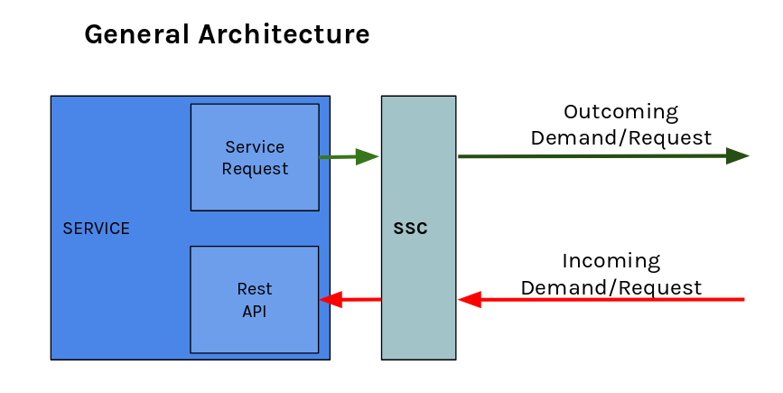

# SeaSwimConnector
Future Public repository, containing the SSC prototype.
w to add!

## Overview 


The SeaSwimConnector is developed using:
- [Maven 3](https://maven.apache.org/install.html) 
- [Spring](https://spring.io/)
- [Oracle Java 8](http://www.oracle.com/technetwork/java/javase/downloads/jdk8-downloads-2133151.html)

 
## Compiling sources

Use maven to compile the source and generate the last version .

```bash 
cd seaswim-connector
mvn clean package
cd ..
cd ssc-client
mvn clean package
cd..
```
## how the SSC work



Ssc is a software service component that works like: 
* Proxy web server: 
    * Listen on a configurable port and intercept the incoming calls. 
    * Check the the STM certificates validity implementing the two way Mutual TLS authentication [mTLS](https://technet.microsoft.com/en-us/library/cc783349(v=ws.10).aspx) 
    * Redirect the incoming call to a configurable internal port
* API that enable to: 
    * Communicate to Identity Registry Requests
        * Set of main request to the  identity registry
    * Communicate to Service Registry Requests
        * Set of main requests to te Service Registry
        * Implementing the OpenIdConnect protocol  
    * Execute REST calls to other STM web services:
        * add to each request the service certificates needed by the STM HTTPS/TLS authentication defined by STM  


## Deploy example


### Structure

```
ssc
 |- seaswim-connector-x.x.x.jar
 |- application.properties
 |- keystores
       |-stm-service-keystores.jks
       |-mc.truststore.jks
```
The described deploy structure describe : 
* Executable: jar executable file 
* Configuration: application.properties: this file contain the SSC configurations
* Java KeyStores: java components used to store the certificates information (Root Certificate  MCP and Service Certificate)

### Keystores and certificates

* Java Keystores are used to contains: 
    * The Application Service certificate downloaded from the Maritime Connectivity Platform
    * The Maritime Connectivity Platform root certificates: this certificate is used by the ssc to verify the incomings call certificates. If are valids STM certificates

#### Certificates and 2-way SSL
(based on [this tutorial](http://www.robinhowlett.com/blog/2016/01/05/everything-you-ever-wanted-to-know-about-ssl-but-were-afraid-to-ask))

1 Configure SSL to use your own CA authority 
```shell
cd <working-dir>
mkdir ssl
cd ssl
mkdir certs private
echo "100001" > serial
touch certindex.txt
<copy openssl.cnf file to current directory>
```
2 Create self-signed CA certificate and generate its PEM file.
```shell
openssl req -new -x509 -extensions v3_ca -keyout private/cakey.pem -out cacert.pem -days 365 -config ./openssl.cnf
```
3 Create server certificate:
   - Create a certificate request for the server
   - Create the certificate using our CA authority
   - Export server certificate in PKCS12 format

**Important: The "Common Name" must match the domain that will be presenting the certificate e.g. localhost**
```shell
openssl req -new -nodes -out server-req.pem -keyout private/server-key.pem -days 365 -config openssl.cnf 
openssl ca -out server-cert.pem -days 365 -config openssl.cnf -infiles server-req.pem 
openssl pkcs12 -export -in server-cert.pem -inkey private/server-key.pem -certfile cacert.pem -name "Server" -out server-cert.p12
```
4 Create client certificate
```shell
openssl req -new -nodes -out client-req.pem -keyout private/client-key.pem -days 365 -config openssl.cnf 
openssl ca -out client-cert.pem -days 365 -config openssl.cnf -infiles client-req.pem 
openssl pkcs12 -export -in client-cert.pem -inkey private/client-key.pem -certfile cacert.pem -name "Client" -out client-cert.p12 
```

#### Creating KeyStores and TrustStores with Keytool**
*"KeyStores provide credentials, TrustStores verify credentials."*

1 Create server keystore with the server certificate
```shell
keytool -importkeystore -deststorepass cimne-server -destkeypass cimne-server -destkeystore server_keystore.jks -srckeystore server-cert.p12 -srcstoretype PKCS12 -srcstorepass cimne-server -alias server
```
2 Create server truststore with the CA certificate
```shell
keytool -import -v -trustcacerts -keystore server_truststore.jks -storepass cimne-server -file cacert.pem -alias cacert
```
3 Create client keystore with the client certificate
```shell
keytool -importkeystore -srckeystore client-cert.p12 -srcstoretype pkcs12 -destkeystore client_keystore.jks -deststoretype jks -deststorepass cimne-client
```
4 Create client truststore with the server certificate
```shell
keytool -import -v -trustcacerts -keystore client_truststore.jks -storepass cimne-client -alias server -file server-cert.pem
```


### Configuration example
Configuration example for the staging environment. 

```properties
#Identity Registry using Certificates base path (URL)
stm.identityRegistry.x509.url=https://staging-api-x509.maritimecloud.net/x509/api

#Identity Registry using OpenId Connect base path (URL)
stm.identityRegistry.oidc.url=https://staging-api.maritimecloud.net/oidc/api

#Service Registry base path
stm.serviceRegistry.url=https://sr-staging.maritimecloud.net/api

#OPENID-CONNECT urls
stm.identityRegistry.openid.auth=https://staging-maritimeid.maritimecloud.net/auth/realms/MaritimeCloud/protocol/openid-connect/auth?
stm.identityRegistry.openid.token=https://staging-maritimeid.maritimecloud.net/auth/realms/MaritimeCloud/protocol/openid-connect/token?

## Logging for debug
logging.level.org.springframework= DEBUG
logging.level.org.apache.http=DEBUG


# SSC configuration server1
connector.name=${name:ssc-vis001}

# properties for application server's configuration

# enables 2-way SSL authentication always on "need" 
server.ssl.client-auth=need

## KEYSTORE SETTINGS ##
# keystore (private key) location
server.ssl.key-store=file:keystores/vis001.jks

# keystore password
server.ssl.key-store-password=changeit

# private key password p12
server.ssl.key-password=changeit

## TRUSTSTORE SETTINGS - trusted certificates ##
# truststore (trusted certificates) location
server.ssl.trust-store=file:keystores/mc-truststore-password-is-changeit.jks

#truststore password
server.ssl.trust-store-password=changeit

## OPEN ID CONNECT CONFIGURATION ##
#redirectPort must begin with 9 (IdentityRegistry requirement)
openid.redirectPort=9991

#redirectURI must begin with http://localhost:9 (IdentityRegistry requirement)
opeind.redirectURI=http://localhost:${openid.redirectPort}/openid/auth


## SSC PORTS CONFIGURATION ##
##  |VISCIMNE1:5501| <-- forwarded_to -- |SSC:8801| <-- incoming calls
##  |VISCIMNE1:5501| --> use private ssc |SSC:7701| --> outGoing calls
# SSC listening Proxy port
server.port=8801

# SSC Private interface
privateAPI.port=7701

# SSC private interface use HTTP
privateAPI.secure=false

# configuration of the service associated to the SSC - the VIS1
service.endpoint=http://localhost:5501

```

    
### Execution

Execute server1 default application properties . The ssc will take the application properties in the same directory
```bash
java  -jar seaswim-connector/target/seaswim-connector-0.0.1.jar
```

Execute server1 with a a custom located application properties file.
```bash
java -Dspring.profiles.active=/path/to/server1 -jar seaswim-connector/target/seaswim-connector-0.0.1.jar
```
